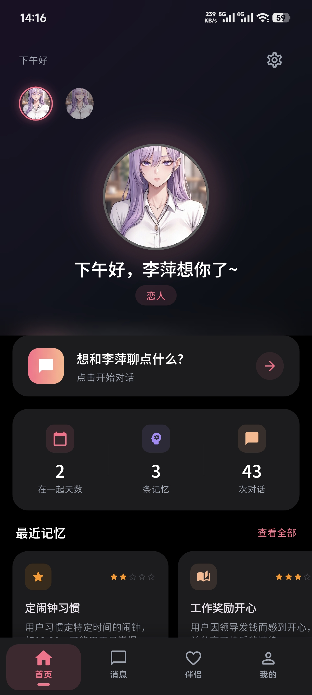
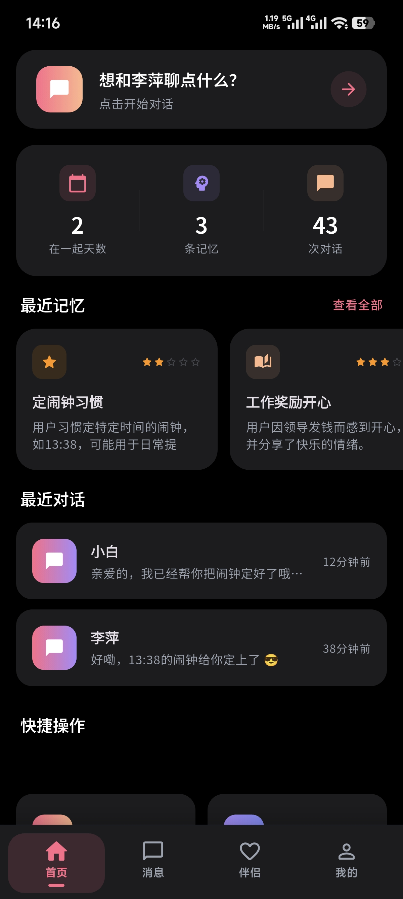
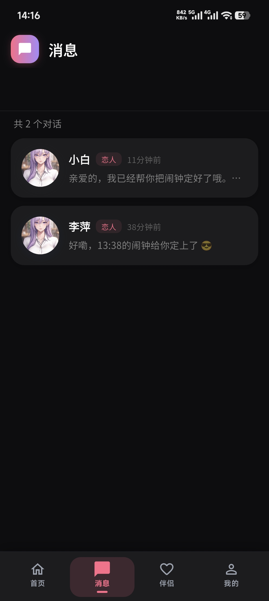
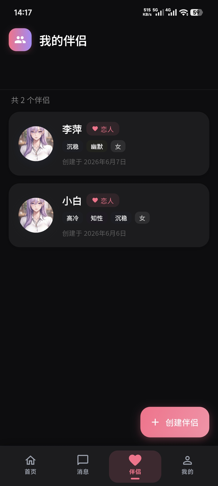
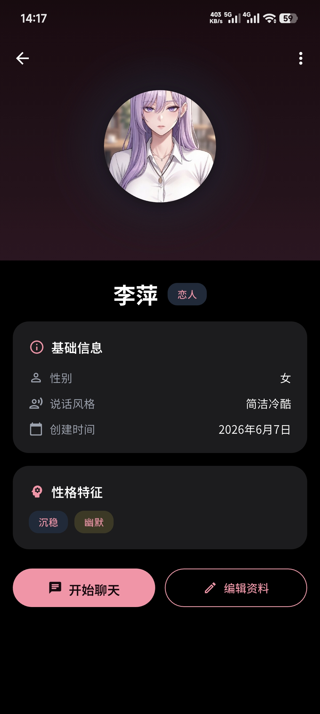
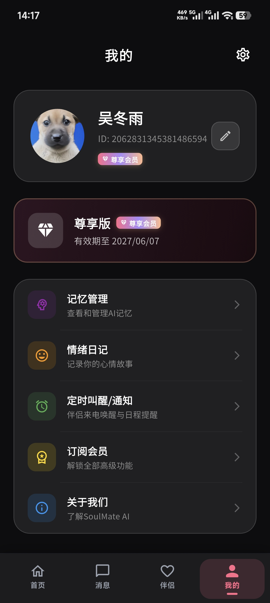
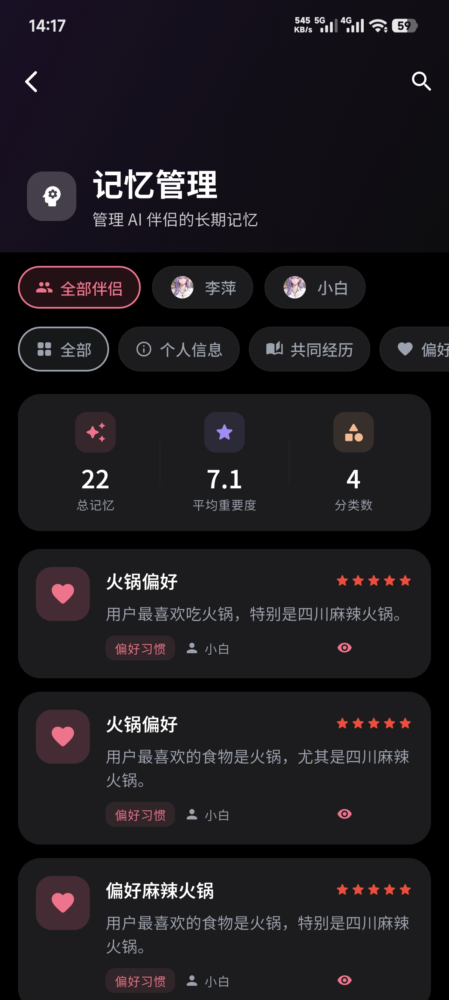
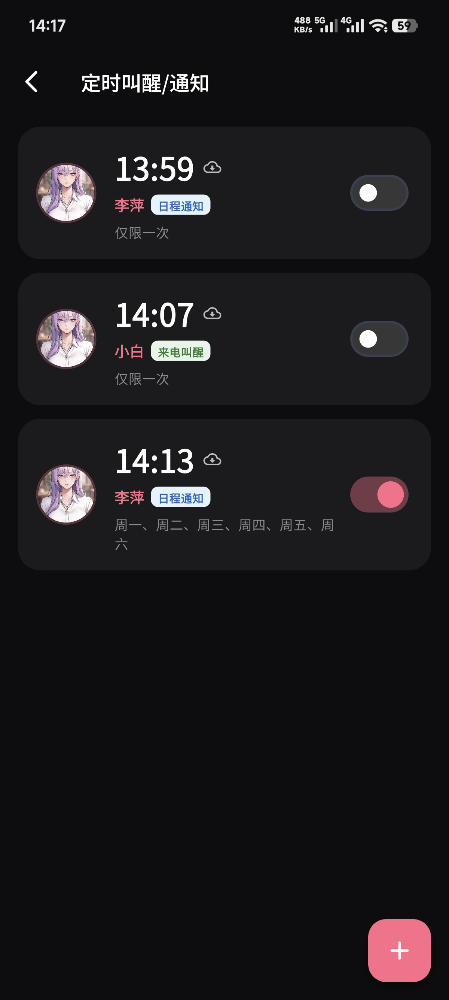
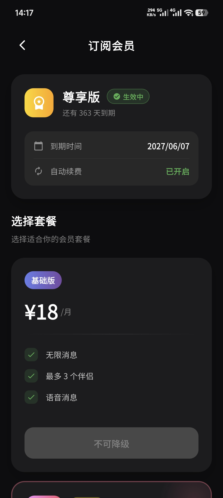
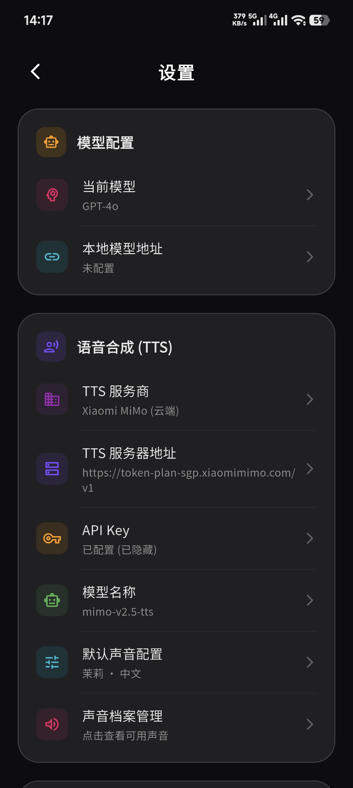

# SoulMate AI (灵魂伴侣AI)

<p align="center">
  
</p>

<p align="center">
  <strong>你的专属 AI 伴侣 — 随时随地，温暖陪伴</strong>
</p>

<p align="center">
  
  
  
  
</p>

---

## 📖 项目简介

SoulMate AI 是一款基于 Flutter 开发的 AI 伴侣聊天移动应用。用户可以创建个性化的 AI 伴侣，设定不同的性格、性别和关系类型，与 AI 伴侣进行实时对话、语音交互，并管理伴侣记忆和定时提醒服务。

---

## ✨ 功能概览

### 产品页面展示

| 页面截图                           | 功能说明                                                    |
|:------------------------------:|:------------------------------------------------------- |
|        | **登录页面** — 支持邮箱验证码登录和游客模式快速体验，首次使用引导用户完成注册流程            |
|        | **首页（推荐）** — 展示推荐的 AI 伴侣卡片，用户可浏览不同风格的伴侣并快速创建对话          |
|        | **首页（分类）** — 按关系类型、性格特征等维度分类展示伴侣，支持个性化筛选                |
|          | **消息页** — 集中展示所有进行中的对话列表，显示最后一条消息和未读状态，支持滑动删除           |
|      | **伴侣管理页** — 管理已创建的所有 AI 伴侣，支持新建、编辑和删除操作                 |
|      | **伴侣详情页** — 查看和编辑伴侣的详细信息，包括头像、性格、说话风格、关系类型等             |
|        | **个人页面** — 用户个人中心，展示头像、昵称、会员状态，提供记忆管理、订阅、设置等入口          |
|      | **记忆管理页** — 查看 AI 伴侣在对话中积累的记忆，支持按伴侣和分类筛选，可编辑或删除记忆       |
|  | **定时服务管理页** — 设置 AI 伴侣的定时提醒任务，支持自定义提醒时间、内容和重复周期         |
|    | **订阅会员页面** — 展示会员权益和订阅方案，支持支付宝支付方式                      |
|      | **设置页** — 应用配置中心，支持主题切换、语言设置、AI 模型参数配置、TTS 语音设置等        |
|          | **聊天页** — 核心对话界面，支持文字消息、语音输入、Markdown 渲染、AI 流式输出和语音合成播放 |
|          | **来电页** — AI 伴侣来电提醒界面，支持接听和挂断操作，搭配铃声震动提示 |
|          | **通话页** — 与 AI 伴侣的实时语音通话界面，支持语音交互和通话控制 |

---

## 🏗️ 项目架构

```
lib/
├── core/                          # 核心基础层
│   ├── di/                        #   依赖注入 (Riverpod Providers)
│   ├── network/                   #   网络层 (Dio, WebSocket, SSE)
│   │   └── interceptors/          #     请求拦截器 (Auth, Logging)
│   ├── routing/                   #   路由管理 (GoRouter)
│   ├── services/                  #   全局服务 (定时提醒调度)
│   └── storage/                   #   本地存储 (SharedPreferences, SecureStorage, Hive)
├── features/                      # 功能模块
│   ├── auth/                      #   认证模块 (邮箱登录, 游客登录)
│   ├── chat/                      #   聊天模块 (消息收发, 语音, TTS)
│   ├── home/                      #   首页模块
│   ├── memory/                    #   记忆管理模块
│   ├── onboarding/                #   新手引导模块
│   ├── partner/                   #   伴侣管理模块
│   ├── profile/                   #   个人中心模块 (含定时提醒)
│   ├── settings/                  #   设置模块
│   ├── splash/                    #   启动页模块
│   └── subscription/              #   订阅会员模块
└── shared/                        # 共享层
    └── models/                    #   数据模型 (Companion, Message, User...)
```

### 路由结构

```
/splash                            启动页
/onboarding                        新手引导
/auth                              登录认证
/call/:reminderId                  来电提醒页

StatefulShellRoute (底部导航栏):

  Tab 0 — 首页
    /home

  Tab 1 — 消息
    /conversations                         消息列表
      /conversations/chat/:id             聊天详情

  Tab 2 — 伴侣
    /partners                              伴侣管理
      /partners/detail/:id                 伴侣详情

  Tab 3 — 我的
    /profile                               个人中心
      /profile/edit                        编辑资料
      /profile/settings                    设置
      /profile/subscription                订阅会员
      /profile/memories                    记忆管理
      /profile/reminders                   定时提醒列表
        /profile/reminders/edit            编辑提醒
```

---

## 🛠️ 技术栈

### 开发语言

| 语言          | 版本        | 说明        |
| ----------- | --------- | --------- |
| **Dart**    | `^3.11.0` | 主要开发语言    |
| **Flutter** | `3.11+`   | 跨平台 UI 框架 |

### 核心依赖

| 类别           | 库                        | 版本         | 说明                  |
| ------------ | ------------------------ | ---------- | ------------------- |
| **状态管理**     | `flutter_riverpod`       | `^2.6.1`   | 响应式状态管理与依赖注入        |
|              | `riverpod_annotation`    | `^2.6.1`   | Riverpod 注解支持       |
| **路由导航**     | `go_router`              | `^14.8.1`  | 声明式路由管理，支持底部导航栏嵌套路由 |
| **网络请求**     | `dio`                    | `^5.7.0`   | HTTP 客户端，支持拦截器、取消请求 |
|              | `retrofit`               | `^4.4.2`   | 类型化 HTTP API 定义     |
|              | `web_socket_channel`     | `^3.0.2`   | WebSocket 实时通信      |
|              | `connectivity_plus`      | `^6.1.3`   | 网络状态监听              |
| **数据持久化**    | `shared_preferences`     | `^2.3.4`   | 轻量级键值存储             |
|              | `flutter_secure_storage` | `^9.2.4`   | 安全存储（Token 等敏感数据）   |
|              | `hive`                   | `^2.2.3`   | 高性能本地数据库            |
|              | `path_provider`          | `^2.1.5`   | 文件路径管理              |
|              | `crypto`                 | `^3.0.6`   | 数据加密                |
| **UI 组件与动画** | `lottie`                 | `^3.3.1`   | Lottie 动画支持         |
|              | `cached_network_image`   | `^3.4.1`   | 网络图片缓存加载            |
|              | `shimmer`                | `^3.0.0`   | 骨架屏加载效果             |
|              | `flutter_animate`        | `^4.5.2`   | 声明式动画框架             |
|              | `flutter_slidable`       | `^3.1.1`   | 列表滑动操作              |
|              | `photo_view`             | `^0.15.0`  | 图片查看器（支持缩放）         |
|              | `image_picker`           | `^1.1.2`   | 图片/相机选择             |
|              | `smooth_page_indicator`  | `^1.2.0+3` | 页面指示器               |
|              | `flutter_markdown`       | `^0.7.6`   | Markdown 渲染         |
| **音频语音**     | `just_audio`             | `^0.9.43`  | 音频播放器               |
|              | `record`                 | `^6.0.0`   | 录音功能                |
|              | `audio_session`          | `^0.1.25`  | 音频会话管理              |
|              | `http`                   | `^1.2.0`   | HTTP 请求（用于音频下载）     |
| **支付**       | `webview_flutter`        | `^4.10.0`  | WebView（支付宝 H5 支付）  |
| **工具类**      | `intl`                   | `^0.19.0`  | 国际化与日期格式化           |
|              | `url_launcher`           | `^6.3.1`   | URL 跳转              |
|              | `permission_handler`     | `^11.3.1`  | 权限管理                |
|              | `google_fonts`           | `^6.2.1`   | Google 字体支持         |
|              | `cupertino_icons`        | `^1.0.8`   | iOS 风格图标            |

### 开发依赖

| 库                        | 版本        | 说明             |
| ------------------------ | --------- | -------------- |
| `very_good_analysis`     | `^7.0.0`  | Dart 代码规范与静态分析 |
| `build_runner`           | `^2.4.15` | 代码生成运行器        |
| `freezed`                | `^2.5.8`  | 不可变数据模型代码生成    |
| `json_serializable`      | `^6.9.4`  | JSON 序列化代码生成   |
| `flutter_launcher_icons` | `^0.14.3` | 应用图标生成         |

---

## 🚀 快速开始

### 环境要求

- Flutter SDK `>= 3.11.0`
- Dart SDK `>= 3.11.0`
- Android Studio / Xcode（用于移动端构建）

### 安装与运行

```bash
# 1. 克隆项目
git clone <repository-url>
cd soulmate-ai-client

# 2. 安装依赖
flutter pub get

# 3. 运行应用
flutter run

# 4. 指定设备运行
flutter run -d <device_id>
```

### 常用命令

```bash
# 代码分析
flutter analyze

# 格式化代码
dart format .

# 运行测试
flutter test

# 代码生成 (freezed / json_serializable)
dart run build_runner build --delete-conflicting-outputs

# 监听文件变化自动重新生成
dart run build_runner watch --delete-conflicting-outputs

# 构建 APK
flutter build apk

# 构建 iOS
flutter build ios
```

---

## 🌐 网络架构

### 服务器配置

应用采用 **双服务器自动故障转移** 机制：

- **主服务器**：`192.168.2.240:8080`
- **备用服务器**：``

当主服务器不可用时，系统自动切换至备用服务器，保证服务连续性。

### API 模块

| 模块        | 说明                       |
| --------- | ------------------------ |
| **认证**    | 邮箱验证码登录、游客登录             |
| **用户**    | 用户信息管理、头像上传、个人资料编辑       |
| **AI 伴侣** | 创建/编辑/删除伴侣，管理伴侣头像        |
| **对话与聊天** | 创建对话、消息列表、普通发送与 SSE 流式对话 |
| **记忆**    | 查看/编辑/删除 AI 伴侣记忆         |
| **订阅**    | 订阅方案查询、当前订阅状态            |
| **支付**    | 创建支付订单（支付宝/微信/银联）、订单状态查询 |
| **文件**    | 文件上传与删除                  |
| **定时提醒**  | 创建/编辑/删除定时提醒任务           |

### 实时通信

- **SSE 流式对话**：通过 `text/event-stream` 实现 AI 回复的逐字流式输出
- **WebSocket**：用于实时消息推送和状态同步

---

## 📂 数据模型

| 模型             | 说明                      |
| -------------- | ----------------------- |
| `Companion`    | AI 伴侣实体（名称、性别、性格、说话风格等） |
| `Conversation` | 对话会话                    |
| `Message`      | 聊天消息（支持文本、语音等内容类型）      |
| `User`         | 用户信息、个人资料与设置            |
| `Memory`       | AI 伴侣记忆（按伴侣和分类管理）       |
| `Reminder`     | 定时提醒任务                  |
| `Subscription` | 订阅方案与用户订阅状态             |
| `TtsConfig`    | 语音合成配置                  |
| `PageResult`   | 分页结果包装器                 |

---

## 📄 License

本项目为私有项目，未经授权不得使用或分发。
