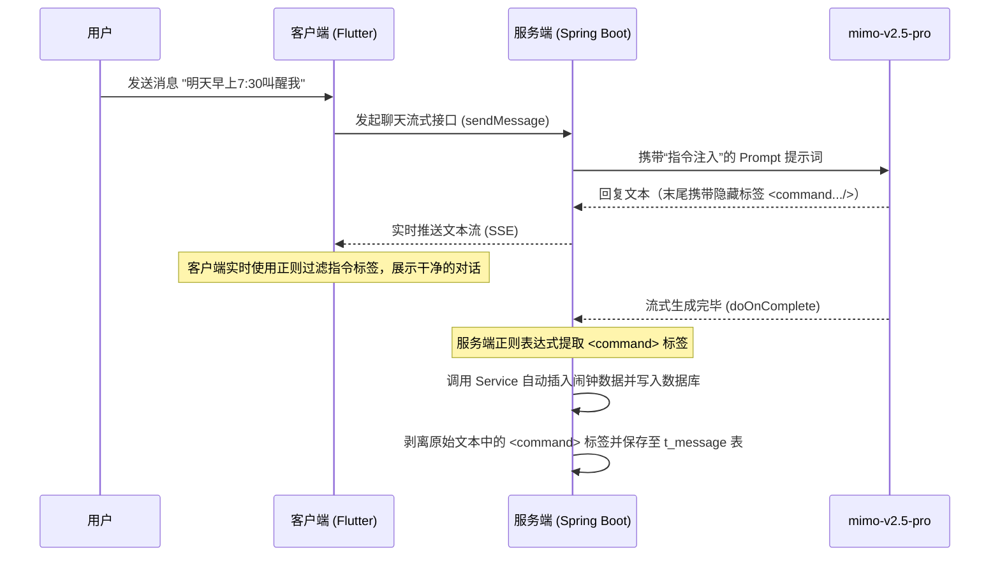

# AI 伴侣主动叫醒与定时通知服务设计方案 (已加入 TTS 预缓存与 AI 自动创建提醒)

该方案旨在为 SoulMate AI 客户端及服务端增加一个**定时叫醒/提醒**功能。用户可以设定特定的时间、选择某位 AI 伴侣并编写叫醒文本。在设定的时间到达时，客户端将全屏弹出类似“通话来电”的界面，接通后伴侣将以语音（TTS）形式向用户朗读预置的内容，实现有温度的“伴侣来电唤醒”体验。

同时，方案支持 **AI 伴侣在聊天中根据用户请求自动创建提醒**。例如当用户对伴侣说“明天早上七点半叫我起床吧”，伴侣在对话回复的同时，会在后台自动为用户创建该定时闹钟。

---

## 1. 核心设计变更与优化

### 1.1 TTS 音频本地预缓存机制 (Pre-caching)
为了保证时间到达时用户能**瞬间接通**，并且即使在**弱网或完全断网（离线）**的情况下闹钟依然能播放伴侣真实的语音，本设计引入**静态预缓存**机制：
* **保存与编辑时下载**：用户或 AI 创建/修改闹钟并保存成功后，客户端立即在后台异步发起 TTS 合成请求，将配置的 `textTemplate` 文本和音色编译为 WAV 语音文件，写入本地持久化目录。
* **持久化目录**：使用应用支持目录（Application Support Directory）下的 `reminder_audio_cache/` 文件夹进行存储，确保不会被操作系统低内存清理时误删。
* **三层兜底降级**：本地 WAV 播放（首选离线 0 延迟） $\rightarrow$ 在线实时 API 请求（次优） $\rightarrow$ 设备系统原生 TTS 朗读兜底 + 系统铃声混音（安全底线，无缓存断网状态下可用）。

### 1.2 AI 伴侣自动创建提醒机制 (AI Auto-creation)
为了让 AI 伴侣具备主动记事和叫醒的能力，我们使用 **“大模型隐藏指令输出 + 后端拦截解析”** 的方案，避免了因 API 功能调用（Function Calling）可能带来的额外网络延迟与兼容性隐患，具体流程如下：



#### A. 提示词注入 (`PromptBuilder.java`)
在系统提示词末尾，为 AI 伴侣注入特定的角色规范，指导其在检测到用户设置提醒的意图时生成隐藏标签：
```markdown
## 定时任务/叫醒来电自动创建规范
当用户在对话中明确请求你“定闹钟”、“叫醒我”、“提醒我某事”等动作时，你应该在回复的【最末尾】输出一条符合以下格式的控制指令，且不要向用户解释这条指令，系统会自动解析。

格式规范：
<command type="create_reminder" time="HH:mm" type_val="WAKE_UP|NOTIFICATION" repeat="1,2,3,4,5">叫醒或提醒的朗读文本</command>

参数定义：
- time: 24小时制时间，格式固定为 "HH:mm"（如 "07:30"），根据用户说的“明早/下午”算准具体时间。
- type_val: 必须是 'WAKE_UP'（用于清晨叫醒、起床）或 'NOTIFICATION'（用于备忘、日程提醒）。
- repeat: 重复星期，逗号分隔，如 "1,2,3,4,5" 代表周一到周五，如果是一次性的则省略或不写。
- 标签文本内容：当你定时拨打电话给用户时，你【主动说话】的内容（200字以内，符合你当前的人格与关系设定）。

示例：
用户：“明天早上7点半叫醒我，温柔一点哦”
你的回复：“没问题呀，明天早上7:30我会准时拨电话叫你起床的，今晚要早点休息哦！<command type="create_reminder" time="07:30" type_val="WAKE_UP">早上好呀，大懒猪快起床啦。今天又是充满希望的一天，记得要开心哦，我一直在想你呢。</command>”
```

#### B. 后端指令拦截与清洗 (`ConversationServiceImpl.java`)
无论是流式会话还是同步会话，在保存 AI 回复数据前拦截并解析：
* **匹配正则表达式**：
  `<command\s+type="create_reminder"\s+time="([^"]+)"\s+type_val="([^"]+)"(?:\s+repeat="([^"]*)")?>(.*?)</command>`
* **后端提取入库**：解析出参数并调用 `CompanionReminderService.createReminder` 存入数据库。
* **消息清洗**：使用 `aiReply.replaceAll("<command.*?>.*?</command>", "").trim()` 剥离标签，将纯净的文字存入 `t_message` 历史记录表。

#### C. 客户端 UI 实时过滤
为防止 SSE 流式传输过程中，用户在聊天气泡里看到还没生成完整的标签代码（如 `<comman...`），客户端展示气泡文本时用正则进行清除过滤：
```dart
// 实时清除可能输出的隐藏指令文本段
final cleanText = rawText.replaceAll(RegExp(r'<command.*?>.*?</command>', dotAll: true), '')
                         .replaceAll(RegExp(r'<command.*$', dotAll: true), ''); // 过滤正在流式输出中未闭合的标签前缀
```

---

## 2. 后端实现架构与技术选型

服务端将严格遵循多模块 Maven 依赖链和设计规范进行实现，使用的具体技术与框架如下：

### 2.1 技术选型与依赖库
* **核心框架**：`Spring Boot` (Web 基础 MVC 构建)。
* **持久层框架**：`MyBatis-Plus` (实现数据库半自动 ORM、BaseMapper 继承与雪花算法 ID 自动分配)。
* **数据校验**：`Hibernate Validator` (使用 `@Validated` 进行 Controller 层入参校验)。
* **代码简化**：`Lombok` (`@Data`, `@Builder`, `@RequiredArgsConstructor` 等)。
* **对象映射**：`MapStruct` (编写 Converter 接口，在编译期生成高性能的 Entity $\leftrightarrow$ DTO $\leftrightarrow$ VO 转换实现)。
* **数据库**：`PostgreSQL 16`，利用 `SQL` 脚本进行表结构配置。

---

### 2.2 模块级详细开发规划

遵循 `web → service → mapper → domain` 依赖链路，后端各模块的类和结构定义如下：

#### 2.2.1 `soulmate-domain` (数据模型层)
新增如下纯数据类，不包含任何业务逻辑：
1. **实体类：`CompanionReminder`**
   * 映射数据库表 `t_companion_reminder`，使用 MyBatis-Plus 注解定义。
   * ID 采用雪花算法分配：`@TableId(type = IdType.ASSIGN_ID)`。
   * 包含逻辑删除字段 `@TableLogic` 映射 `deleted`。
   * 字段：`id`, `userId`, `companionId`, `reminderTime`, `repeatDays`, `textTemplate`, `type` (枚举映射为 String), `enabled`, `createTime`, `updateTime`, `deleted`。
2. **提醒类型枚举：`ReminderType`**
   * 定义为 `UPPERCASE` 枚举：`WAKE_UP` (叫醒), `NOTIFICATION` (通知)。在存入数据库时使用 MyBatis-Plus 默认的枚举处理器将其序列化为 `VARCHAR` 字符串。
3. **数据传输对象：`CompanionReminderDto`**
   * 用于接收客户端 POST (创建) 和 PUT (编辑) 的参数。
   * 使用 `@Validated` 校验：
     * `companionId`：`@NotNull(message = "伴侣ID不能为空")`
     * `reminderTime`：`@NotBlank` 且配有正则表达式 `@Pattern(regexp = "^([01]\\d|2[0-3]):[0-5]\\d$", message = "时间格式必须为 HH:mm")`
     * `textTemplate`：`@NotBlank(message = "说话模板不能为空")`，限制长度最大 `@Size(max = 500)`
     * `type`：`@NotNull` 必须为合法枚举值
     * `repeatDays`：`List<Integer>`，限制元素在 `1-7` 之间。
4. **视图呈现对象：`CompanionReminderVo`**
   * 用于返给客户端接口的结构。包括字段：ID、伴侣 ID、伴侣名称、伴侣头像 URL、时间、重复星期、说话文本、闹钟类型、启用状态。
5. **转换器：`CompanionReminderConverter`**
   * MapStruct 接口，针对 `repeatDays` 提供 List 与 CSV 字符串的映射转换方法。

#### 2.2.2 `soulmate-mapper` (持久层)
* **`CompanionReminderMapper`**：继承 MyBatis-Plus 的 `BaseMapper<CompanionReminder>`。

#### 2.2.3 `soulmate-service` (业务逻辑层)
* **服务接口：`CompanionReminderService`**
  * 定义基础增删改查接口。
  * **新增接口**：`void parseAndCreateReminder(Long userId, Long companionId, String content)`：解析 AI 对话回复中的控制标签并转化为数据入库。
* **业务实现类：`CompanionReminderServiceImpl`**
  * 标注 `@Service`、`@RequiredArgsConstructor` 和 `@Transactional`。
  * 实现中执行伴侣归属校验和用户安全边界校验。使用正则实现隐藏指令标签的解析和调用。

#### 2.2.4 `soulmate-web` (控制层)
* **控制器：`CompanionReminderController`**
  * 注册在 `/api/reminders` 路由，通过请求属性自动获取 `@RequestAttribute("currentUserId") Long userId` 进行会话安全限制。

---

## 3. 服务端数据库初始化脚本 (PostgreSQL DDL)

在 `soulmate-app` 对应的 `sql/init.sql` 文件末尾，新增如下建表 DDL 语句：

```sql
-- =============================================
-- 6. AI 伴侣定时唤醒提醒模块
-- =============================================

CREATE TABLE IF NOT EXISTS t_companion_reminder (
    id              BIGINT       PRIMARY KEY,
    user_id         BIGINT       NOT NULL,
    companion_id    BIGINT       NOT NULL,
    reminder_time   VARCHAR(5)   NOT NULL, -- 格式 "HH:mm"，例如 "07:30"
    repeat_days     VARCHAR(32),           -- 逗号分隔如 "1,2,3,4,5"，空代表仅一次
    text_template   VARCHAR(512) NOT NULL, -- 主动叫醒/提醒说话模板
    type            VARCHAR(32)  NOT NULL, -- 'WAKE_UP' (叫醒) 或 'NOTIFICATION' (通知)
    enabled         SMALLINT     DEFAULT 1, -- 1=启用，0=停用
    create_time     TIMESTAMP    NOT NULL DEFAULT CURRENT_TIMESTAMP,
    update_time     TIMESTAMP    NOT NULL DEFAULT CURRENT_TIMESTAMP,
    deleted         SMALLINT     DEFAULT 0
);

CREATE INDEX IF NOT EXISTS idx_reminder_user_id ON t_companion_reminder(user_id);
```

---

## 4. 客户端路由与页面规划

### 4.1 页面路由与菜单
* `/profile/reminders` $\rightarrow$ `ReminderListPage` (管理列表页)
* `/profile/reminders/edit` $\rightarrow$ `ReminderEditPage` (编辑/新增页)
* `/call/:reminderId` $\rightarrow$ `IncomingCallPage` (全屏独立呼叫页，跳过 `MainScaffold` 壳组件)

### 4.2 页面及同步机制
* 列表支持 Switch 开启/禁用，左滑 Slidable 逻辑删除。展示 `语音同步就绪` 状态。
* 客户端对话页展示文字时，利用正则对流式和静态消息中的 `<command>` 指令块进行过滤清洗，确保用户端 UI 的纯净呈现。

### 4.3 全屏通话与朗读页设计
* **振铃阶段**：毛玻璃伴侣专属主色背景，圆形头像，外围带发光波圈（Ripples）向外层叠扩散。背景播放 loop 电话音。
* **通话阶段**：头像过渡缩小至上方，展示 5-7 条跳动声波柱（模拟波形），调用本地预缓存的伴侣 TTS WAV 音频包（0 延迟离线播放）。音频结束 2 秒后自动挂断返回，页面中不需要显示朗读的文字。

---

## 5. 验证与测试方案 (Verification Plan)

### 5.1 AI 自动创建联调测试
- **测试步骤**：
  1. 手机连网，进入与 AI 伴侣的聊天会话。
  2. 发送消息：“明天早上七点半，定一个温柔起床的闹钟”。
  3. AI 伴侣回复（例如：“好呀，明早 7:30 我会打给你...”），验证客户端展示的回复文本中**不包含任何 XML 标签**。
  4. 返回“我的” -> “定时叫醒/通知”，验证列表中**已经自动生成了“07:30”的清晨叫醒任务**，且该条目的本地语音包显示“已就绪”。
  5. 检查数据库，确认 `t_message` 表中保存的 AI 回复已被彻底清洗，不含指令标签；而 `t_companion_reminder` 中新增了该闹钟数据。

### 5.2 离线兜底降级手动验证
- **测试步骤**：
  1. 定时一个 1 分钟后的闹钟，手机断网（模拟离线），App 居于前台。
  2. 到点弹出来电，点击接听，验证伴侣能否在无网状态下瞬间朗读（WAV 预缓存测试）。
  3. 手动删除本地文件，再次在断网状态下等待来电。点击接听，验证手机能否触发原生系统的 TTS 发声兜底。
